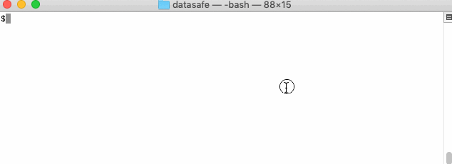
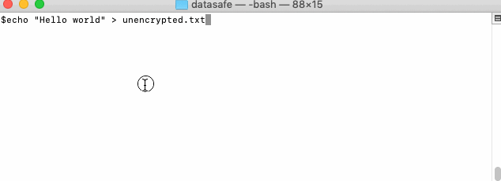
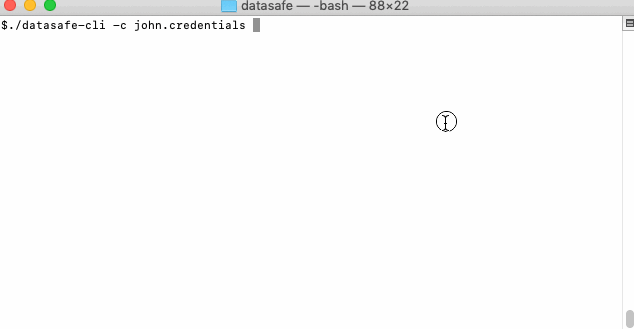

[](https://travis-ci.com/adorsys/datasafe)
[](https://codecov.io/gh/adorsys/datasafe)
[](https://codeclimate.com/github/adorsys/datasafe/maintainability)


# General information
Datasafe is a cross-platform library that allows sharing and storing data and documents securely. It encrypts
your data using **AES-GCM** algorithm and uses **CMS-envelopes** as encrypted content wrapper. CMS-envelope
wraps and encrypts document encryption key using key encryption key that provides additional level of security.
For user private files, Datasafe uses CMS-envelope with symmetric encryption of data encryption key. For files
that are shared with other users (sent to their INBOX folder), Datasafe uses asymmetric encryption for
data encryption key, so only recipient (or multiple recipients) can read it.

Datasafe is built with the idea to be as configurable as possible - it uses Dagger2 for dependency injection and modular
architecture to combine everything into the business layer, so the user can override any aspect he wants - i.e. to change
encryption algorithm or to turn path encryption off. Each module is as independent as it is possible - to be used separately.

- Each user has private space that can reside on Amazon S3, minio, filesystem or anything else with proper adapter.
In his private space, each document and its path is encrypted.
- For document sharing user has inbox space, that can be accessed from outside. Another user can write the document he
wants to share into users' inbox space using the recipients' public key so that only inbox owner can read it.
- For storage systems that do not support file versioning natively (i.e. minio) this library provides versioning
capability too.

Details about used encryption algorithms can be found in [security whitepaper](SECURITY.WHITEPAPER.md).

## Features

-  Proprietary software **friendly license**
-  **Flexibility** - you can easily change encryption and configure or customize other aspects of library
-  AES encryption using **CMS-envelopes** for increased security and interoperability with other languages
-  Secure file sharing with other users
-  **Extra protection layer** - encryption using securely generated keys that are completely unrelated to your password
-  **Client side encryption** - you own your data
-  Works with filesystem and Amazon S3 compatible storage - S3, minio, CEPH, etc.
-  File names are encrypted
-  Thorough testing

## Performance

Datasafe was tested for performance in Amazon cloud.
In short, on m5.xlarge amazon instance with Datasafe library can have write throughput of 50 MiB/s and 80 MiB/s of
read throughput, when using **Amazon S3 bucket** as backing storage (performance is CPU-bound and network-bound).

Detailed performance report is here:
[Datasafe performance results](datasafe-long-run-tests/README.md)

## Quick demo
### Datasafe-CLI
You can try Datasafe as a CLI (command-line-interface) executable for encryption of your own sensitive files.
Your encrypted files can be saved either in S3 bucket or local filesystem safely, because encryption will happen
locally - on your machine (See [CLI-README](datasafe-cli/README.md) for details).

**Download CLI executable**:

1. [MacOS native executable](https://github.com/adorsys/datasafe/releases/download/v0.7.0/datasafe-cli-osx-x64)
1. [Linux native executable](https://github.com/adorsys/datasafe/releases/download/v0.7.0/datasafe-cli-linux-x64)
1. Windows executable (N/A yet), please use java version below
1. [Java-based jar](https://github.com/adorsys/datasafe/releases/download/v0.7.0/datasafe-cli.jar), requires JRE (1.8+), use `java -jar datasafe-cli.jar` to execute

#### Example actions:
##### Download application and create new user:

<details><summary>New profile animation transcript</summary>

- Download CLI application (MacOS url)

```bash
curl -L https://github.com/adorsys/datasafe/releases/download/v0.6.0/datasafe-cli-osx-x64 > datasafe-cli && chmod +x datasafe-cli
```
- Create file with your credentials (they also can be passed through commandline)

```bash
echo '{"username": "john", "password": "Doe", "systemPassword": "password"}' > john.credentials
```
- Create your new user profile (credentials come from john.credentials). You can enter value or click enter to accept
the default value when prompted.

```bash
./datasafe-cli -c john.credentials profile create
```
</details>



**Note**: Instead of creating file with credentials you can provide credentials directly into terminal (this is less
secure than having credentials file, but is fine for demo purposes):
```bash
./datasafe-cli -u=MeHappyUser -p=MyCoolPassword -sp=greatSystemPassword private cat secret.txt
```
Command above will show private file `secret.txt` content for user `MeHappyUser` who has password `MyCoolPassword` and
system password `greatSystemPassword`

##### Encrypt and decrypt some secret data for our user:

<details><summary>Encrypting/decrypting data animation transcript</summary>

- Create some unencrypted content

```bash
echo "Hello world" > unencrypted.txt
```
- Encrypt and store file from above in privatespace. In privatespace it will have decrypted name `secret.txt`
```bash
./datasafe-cli -c john.credentials private cp unencrypted.txt secret.txt
```
- Show that filename is encrypted in privatespace:

```bash
ls private
```

- Show that file content is encrypted too:

```bash
cat private/encrypted_file_name_from_above
```

- Decrypt file content:

```bash
./datasafe-cli -c john.credentials private cat secret.txt
```
</details>



##### You can always list available actions in context:

<details><summary>List actions animation transcript</summary>

- Show top-level commands

```bash
./datasafe-cli -c john.credentials
```

- Show commands for privatespace

```bash
./datasafe-cli -c john.credentials private
```
</details>



### REST based demo
[Here](datasafe-rest-impl/DEMO.md) you can find quick docker-based demo of project capabilities with
instructions of how to use it (REST-api based to show how to deploy as encryption server).


## Building project
Without tests:
```bash
mvn clean install -DskipTests=true
```
Full build:
```bash
mvn clean install
```

## Adding to your project

Datasafe is available from maven-central repository, you can add it to your project using:
```xml
<dependency>
    <groupId>de.adorsys</groupId>
    <artifactId>datasafe-business</artifactId>
    <version>0.5.0</version>
</dependency>
```

To add filesystem storage provider:
```xml
<dependency>
    <groupId>de.adorsys</groupId>
    <artifactId>datasafe-storage-impl-fs</artifactId>
    <version>0.5.0</version>
</dependency>
```

To add S3 storage provider:
```xml
<dependency>
    <groupId>de.adorsys</groupId>
    <artifactId>datasafe-storage-impl-s3</artifactId>
    <version>0.5.0</version>
</dependency>
```


# Project overview
In short, Datasafe [core logic](datasafe-business/src/main/java/de/adorsys/datasafe/business/impl/service/DefaultDatasafeServices.java)
provides these key services:
* [Privatespace service](datasafe-privatestore/datasafe-privatestore-impl/src/main/java/de/adorsys/datasafe/privatestore/impl/PrivateSpaceServiceImpl.java)
that securely stores private files by encrypting them using users' secret key.
* [Inbox service](datasafe-inbox/datasafe-inbox-impl/src/main/java/de/adorsys/datasafe/inbox/impl/InboxServiceImpl.java)
that allows a user to share files with someone so that the only inbox owner can read files that are
shared with him using private key.
* [User profile service](datasafe-directory/datasafe-directory-impl/src/main/java/de/adorsys/datasafe/directory/impl/profile/operations/DFSBasedProfileStorageImpl.java)
that provides user metadata, such as where is user privatespace, his keystore, etc.

These services are automatically built from
[modules](datasafe-business/src/main/java/de/adorsys/datasafe/business/impl)
and the only thing needed from a user is to provide storage adapter - by using
[predefined](datasafe-storage) adapters,
or by implementing his own using
[this interface](datasafe-storage/datasafe-storage-api/src/main/java/de/adorsys/datasafe/storage/api/StorageService.java).

These services have interfaces that resemble actions that you can do with file or folder on your local file system -
list,write,read,delete file or folder. So, one can think that Datasafe provides mount-points for
inbox and private space virtual folders - you get similar actions available from Datasafe service.

Additionally, for file versioning purposes like reading only last file version, there is [versioned privatespace](datasafe-business/src/main/java/de/adorsys/datasafe/business/impl/service/VersionedDatasafeServices.java)
that supports versioned and encrypted private file storage (for storage providers that do not support versioning).

# How it works

## Library modules


## Users' files - where are they?

Whenever user wants to store or read file at some location - be it inbox or his private space, following things do happen:
1. System resolves his profile location
1. His profile is read from some storage (and typically cached, then direct cache access happens)
1. Based on his profile content, root folder where data should be read/written is deduced
1. If data is going to private space - request path is encrypted
1. Root path is prepended to request path
1. Encryption/decryption of data happens
1. Credentials required to access the storage are added ([BucketAccessService](datasafe-directory/datasafe-directory-api/src/main/java/de/adorsys/datasafe/directory/api/profile/dfs/BucketAccessService.java))
1. Data stream with path is sent to storage adapter
1. Optionally, storage adapter analyzes based on protocol which storage service to use
1. Storage adapter stores the data

This diagram shows path resolution flow for private space with more details. It is mostly same both for private and
inbox files, with the only difference that private files have relative path (relative to private space location)
additionally encrypted.


## Storing private files

Private files are always encrypted using users' secret symmetric key. Additionally their path is encrypted too, but
this encryption is very special in the sense that it has form of a/b/c encrypted as
encrypted(a)/encrypted(b)/encrypted(c), so that folder traversal operations are efficient.


| Reading files from private space | Writing files to private space  |
|---|---|
|   |   |

[Details](datasafe-privatestore)

## Sharing files with another user

Shared files are protected using asymmetrical cryptography, so that sender encrypts file with recipients' public key
and only recipient can read it using his private key. Paths are kept unencrypted for inbox.


| Reading files from inbox | Writing files to inbox  |
|---|---|
|   |   |

[Details](datasafe-inbox)

# Examples of how to use the library
<!--
To update snippets you can use embed.sh
MacOS: Install gnused and gnugrep:
`brew install gnu-sed`
`brew install grep`

Example script usage:
./embed.sh Example README.md > README-tmp.md && mv README-tmp.md README.md

TODO: Migrate to AsciiDoc for automatic snippet embedding.
-->

## Generic Datasafe usage
First, you want to create Datasafe services. This snippet provides you Datasafe that uses filesystem storage adapter:
[Example:Create Datasafe services](datasafe-examples/datasafe-examples-business/src/test/java/de/adorsys/datasafe/examples/business/filesystem/BaseUserOperationsTestWithDefaultDatasafeTest.java#L46-L52)
```groovy
// this will create all Datasafe files and user documents under <temp dir path>
defaultDatasafeServices = DaggerDefaultDatasafeServices.builder()
        .config(new DefaultDFSConfig(root.toAbsolutePath().toUri(), "secret"::toCharArray))
        .storage(new FileSystemStorageService(root))
        .build();
```

Second you want to add new users:
[Example:Create new user](datasafe-examples/datasafe-examples-business/src/test/java/de/adorsys/datasafe/examples/business/filesystem/BaseUserOperationsTestWithDefaultDatasafeTest.java#L60-L67)
```groovy
// Creating new user with username 'user' and private/secret key password 'passwrd':
/*
IMPORTANT: For cases when user profile is stored on S3 without object locks, this requires some global
synchronization due to eventual consistency or you need to supply globally unique username on registration
*/
defaultDatasafeServices.userProfile().registerUsingDefaults(new UserIDAuth("user", "passwrd"::toCharArray));
```

After you have a user, he wants to store some data or document securely in his privatespace:
[Example:Store file in privatespace](datasafe-examples/datasafe-examples-business/src/test/java/de/adorsys/datasafe/examples/business/filesystem/BaseUserOperationsTestWithDefaultDatasafeTest.java#L78-L88)
```groovy
// creating new user
UserIDAuth user = registerUser("john");

// writing string "Hello" to my/own/file.txt:
// note that both resulting file content and its path are encrypted:
try (OutputStream os = defaultDatasafeServices.privateService()
        .write(WriteRequest.forDefaultPrivate(user, "my/own/file.txt"))) {
    os.write("Hello".getBytes(StandardCharsets.UTF_8));
}
```

Now user wants to read again his secured file:
[Example:Read file from privatespace](datasafe-examples/datasafe-examples-business/src/test/java/de/adorsys/datasafe/examples/business/filesystem/BaseUserOperationsTestWithDefaultDatasafeTest.java#L99-L112)
```groovy
// creating new user
UserIDAuth user = registerUser("jane");

// writing string "Hello Jane" to my/secret.txt into users' Jane privatespace:
writeToPrivate(user, "my/secret.txt", "Hello Jane");

byte[] helloJane;
// reading encrypted data from my/secret.txt, note that path is also encrypted
try (InputStream is = defaultDatasafeServices.privateService()
        .read(ReadRequest.forDefaultPrivate(user, "my/secret.txt"))) {
    helloJane = ByteStreams.toByteArray(is);
}
```

But he doesn't remember the name of file he stored, so he will list all files in privatespace and read first:
[Example:Read file from privatespace using list](datasafe-examples/datasafe-examples-business/src/test/java/de/adorsys/datasafe/examples/business/filesystem/BaseUserOperationsTestWithDefaultDatasafeTest.java#L246-L260)
```groovy
// creating new user
UserIDAuth user = registerUser("john");

// let's create 1 file:
writeToPrivate(user, "home/my/secret.txt", "secret");

List<AbsoluteLocation<ResolvedResource>> johnsPrivateFilesInMy = defaultDatasafeServices.privateService()
        .list(ListRequest.forDefaultPrivate(user, "home/my")).collect(Collectors.toList());

// we have successfully read that file
assertThat(defaultDatasafeServices.privateService().read(
        ReadRequest.forPrivate(user, johnsPrivateFilesInMy.get(0).getResource().asPrivate()))
).hasContent("secret");
```

Now he wants to share some data with another user:
[Example:Send file to INBOX](datasafe-examples/datasafe-examples-business/src/test/java/de/adorsys/datasafe/examples/business/filesystem/BaseUserOperationsTestWithDefaultDatasafeTest.java#L124-L134)
```groovy
// create Jane, so her INBOX does exist
UserIDAuth jane = registerUser("jane");
UserID janeUsername = new UserID("jane");

// We send message "Hello John" to John just by his username
try (OutputStream os = defaultDatasafeServices.inboxService()
        .write(WriteRequest.forDefaultPublic(Collections.singleton(janeUsername), "hello.txt"))) {
    os.write("Hello Jane".getBytes(StandardCharsets.UTF_8));
}
```

Now he wants to share some data with couple of users, so that it will be encrypted once and they both
could read the file using each using own private key:
[Example:Send file to INBOX - multiple users](datasafe-examples/datasafe-examples-business/src/test/java/de/adorsys/datasafe/examples/business/filesystem/BaseUserOperationsTestWithDefaultDatasafeTest.java#L146-L158)
```groovy
// create Jane, so her INBOX does exist
UserIDAuth jane = registerUser("jane");
// create Jamie, so his INBOX does exist
UserIDAuth jamie = registerUser("jamie");

// We send message to both users by using their username:
try (OutputStream os = defaultDatasafeServices.inboxService().write(
        WriteRequest.forDefaultPublic(ImmutableSet.of(jane.getUserID(), jamie.getUserID()), "hello.txt"))
) {
    os.write("Hello Jane and Jamie".getBytes(StandardCharsets.UTF_8));
}
```

And finally it is time to read data that was shared with you:
[Example:Read file from INBOX](datasafe-examples/datasafe-examples-business/src/test/java/de/adorsys/datasafe/examples/business/filesystem/BaseUserOperationsTestWithDefaultDatasafeTest.java#L268-L284)
```groovy
// creating new user
UserIDAuth user = registerUser("john");
UserID johnUsername = new UserID("john");

// let's create 1 file:
shareMessage(johnUsername, "home/my/shared.txt", "shared message");

// Lets list our INBOX
List<AbsoluteLocation<ResolvedResource>> johnsInboxFilesInMy = defaultDatasafeServices.inboxService()
        .list(ListRequest.forDefaultPrivate(user, "")).collect(Collectors.toList());

// we have successfully read that file
assertThat(defaultDatasafeServices.inboxService().read(
        ReadRequest.forPrivate(user, johnsInboxFilesInMy.get(0).getResource().asPrivate()))
).hasContent("shared message");
```

## Datasafe with file versioning
Suppose we need to preserve file history, so accidental file removal won't destroy everything. In such case
we can use storage provider that supports versioning. But if we have storage provider does not support versions
(i.e. minio) we can turn-on software versioning, here is its usage examples;

First, we will obtain versioned Datasafe services that uses filesystem storage adapter:
[Example:Create versioned Datasafe services](datasafe-examples/datasafe-examples-business/src/test/java/de/adorsys/datasafe/examples/business/filesystem/BaseUserOperationsTestWithVersionedDatasafeTest.java#L47-L53)
```groovy
// this will create all Datasafe files and user documents under <temp dir path>
versionedServices = DaggerVersionedDatasafeServices.builder()
        .config(new DefaultDFSConfig(root.toAbsolutePath().toUri(), "secret"::toCharArray))
        .storage(new FileSystemStorageService(root))
        .build();
```

Next we will create user, this is same as in non-versioned services:
[Example:Creating user for versioned services looks same](datasafe-examples/datasafe-examples-business/src/test/java/de/adorsys/datasafe/examples/business/filesystem/BaseUserOperationsTestWithVersionedDatasafeTest.java#L61-L68)
```groovy
// Creating new user:
/*
IMPORTANT: For cases when user profile is stored on S3 without object locks, this requires some global
synchronization due to eventual consistency or you need to supply globally unique username on registration
*/
versionedServices.userProfile().registerUsingDefaults(new UserIDAuth("user", "passwrd"::toCharArray));
```

This is how file versioning works when saving file multiple times:
[Example:Saving file couple of times - versioned](datasafe-examples/datasafe-examples-business/src/test/java/de/adorsys/datasafe/examples/business/filesystem/BaseUserOperationsTestWithVersionedDatasafeTest.java#L80-L104)
```groovy
// creating new user
UserIDAuth user = registerUser("john");

// writing string "Hello " + index to my/own/file.txt 3 times:
// note that both resulting file content and its path are encrypted:
for (int i = 1; i <= 3; ++i) {
    try (OutputStream os = versionedServices.latestPrivate()
            .write(WriteRequest.forDefaultPrivate(user, "my/own/file.txt"))) {
        os.write(("Hello " + i).getBytes(StandardCharsets.UTF_8));
        Thread.sleep(1000L); // this will change file modified dates
    }
}

// and still we read only latest file
assertThat(versionedServices.latestPrivate()
        .read(ReadRequest.forDefaultPrivate(user, "my/own/file.txt"))
).hasContent("Hello 3");
// but there are 3 versions of file stored physically in users' privatespace:
assertThat(versionedServices.privateService().list(
    ListRequest.forDefaultPrivate(user, "my/own/file.txt"))
).hasSize(3);
// and still only one file visible on latest view
assertThat(versionedServices.latestPrivate().list(ListRequest.forDefaultPrivate(user, ""))).hasSize(1);
```

And we can work with file versions too, of course, everything is encrypted:
[Example:Lets check how to read oldest file version](datasafe-examples/datasafe-examples-business/src/test/java/de/adorsys/datasafe/examples/business/filesystem/BaseUserOperationsTestWithVersionedDatasafeTest.java#L106-L122)
```groovy
// so lets collect all versions
List<Versioned<AbsoluteLocation<ResolvedResource>, PrivateResource, DFSVersion>> withVersions =
    versionedServices.versionInfo().versionsOf(
        ListRequest.forDefaultPrivate(user, "my/own/file.txt")
    ).collect(Collectors.toList());
// so that we can find oldest
Versioned<AbsoluteLocation<ResolvedResource>, PrivateResource, DFSVersion> oldest =
    withVersions.stream()
        .sorted(Comparator.comparing(it -> it.absolute().getResource().getModifiedAt()))
        .collect(Collectors.toList())
        .get(0);
// and read oldest content
assertThat(versionedServices.privateService()
    .read(ReadRequest.forPrivate(user, oldest.absolute().getResource().asPrivate()))
).hasContent("Hello 1");
```

Another important case to mention  is how to determine if file has changed on storage compared to some copy we have:
[Example:Check if we have latest file locally](datasafe-examples/datasafe-examples-business/src/test/java/de/adorsys/datasafe/examples/business/filesystem/BaseUserOperationsTestWithVersionedDatasafeTest.java#L132-L163)
```groovy
// creating new user
UserIDAuth user = registerUser("john");

// First lets store some file, for example John stored it from mobile phone
try (OutputStream os = versionedServices.latestPrivate()
        .write(WriteRequest.forDefaultPrivate(user, "my/own/file.txt"))) {
    os.write(("Hello old version").getBytes(StandardCharsets.UTF_8));
}

// Application on mobile phone caches file content to improve performance, so it should cache timestamp too
Instant savedOnMobile = versionedServices.latestPrivate()
        .list(ListRequest.forDefaultPrivate(user, "my/own/file.txt"))
        .findAny().get().getResource().getModifiedAt();

// Now John uses PC to write data to my/own/file.txt with some updated data
Thread.sleep(1000L); // it took some time for him to get to PC
try (OutputStream os = versionedServices.latestPrivate()
        .write(WriteRequest.forDefaultPrivate(user, "my/own/file.txt"))) {
    os.write(("Hello new version").getBytes(StandardCharsets.UTF_8));
}

// John takes his mobile phone and application checks if it needs to sync content
Instant savedOnPC = versionedServices.latestPrivate()
        .list(ListRequest.forDefaultPrivate(user, "my/own/file.txt"))
        .findAny().get().getResource().getModifiedAt();

// This indicates that we need to update our cache on mobile phone
// Modified date of saved file has changed and it is newer that our cached date
// So mobile application should download latest file version
assertThat(savedOnPC).isAfter(savedOnMobile);
```

## Datasafe on versioned storage
If you have storage for user files on **versioned S3 bucket** and want to get object version when you write
object or to read some older version encrypted object, you can follow this example of how to do that:
[Example:Versioned storage support - writing file and reading back](datasafe-examples/datasafe-examples-versioned-s3/src/test/java/de/adorsys/datasafe/examples/business/s3/BaseUserOperationsWithDefaultDatasafeOnVersionedStorageTest.java#L138-L172)
```groovy
// creating new user
UserIDAuth user = registerUser("john");

// writing data to my/own/file.txt 3 times with different content:
// 1st time, writing into my/own/file.txt:
// Expanded snippet of how to capture file version when writing object:
AtomicReference<String> version = new AtomicReference<>();
try (OutputStream os = defaultDatasafeServices.privateService()
        .write(WriteRequest.forDefaultPrivate(user, MY_OWN_FILE_TXT)
                .toBuilder()
                .callback((PhysicalVersionCallback) version::set)
                .build())
) {
    // Initial version will contain "Hello 1":
    os.write("Hello 1".getBytes(StandardCharsets.UTF_8));
}
// this variable has our initial file version:
String version1 = version.get();

// Write 2 more times different data to same file - my/own/file.txt:
String version2 = writeToPrivate(user, MY_OWN_FILE_TXT, "Hello 2");
// Last version will contain "Hello 3":
String version3 = writeToPrivate(user, MY_OWN_FILE_TXT, "Hello 3");

// now, when we read file without specifying version - we see latest file content:
assertThat(defaultDatasafeServices.privateService().read(
        ReadRequest.forDefaultPrivate(user, MY_OWN_FILE_TXT))
).hasContent("Hello 3");

// but if we specify file version - we get content for it:
assertThat(defaultDatasafeServices.privateService().read(
        ReadRequest.forDefaultPrivateWithVersion(user, MY_OWN_FILE_TXT, new StorageVersion(version1)))
).hasContent("Hello 1");
```
Removing old file version can be done by [bucket policy](https://docs.aws.amazon.com/AmazonS3/latest/dev/intro-lifecycle-rules.html#non-current-days-calculations)
or manually, using this snippet:
[Example:Versioned storage support - removing specific version](datasafe-examples/datasafe-examples-versioned-s3/src/test/java/de/adorsys/datasafe/examples/business/s3/BaseUserOperationsWithDefaultDatasafeOnVersionedStorageTest.java#L188-L215)
```groovy
// creating new user
UserIDAuth user = registerUser("john");

// writing data to my/own/file.txt 2 times with different content:
String versionId = writeToPrivate(user, MY_OWN_FILE_TXT, "Hello 1");
writeToPrivate(user, MY_OWN_FILE_TXT, "Hello 2");

// now, we read old file version
assertThat(defaultDatasafeServices.privateService().read(
        ReadRequest.forDefaultPrivateWithVersion(user, MY_OWN_FILE_TXT, new StorageVersion(versionId)))
).hasContent("Hello 1");

// now, we remove old file version
defaultDatasafeServices.privateService().remove(
        RemoveRequest.forDefaultPrivateWithVersion(user, MY_OWN_FILE_TXT, new StorageVersion(versionId))
);

// it is removed from storage, so when we read it we get exception
assertThrows(AmazonS3Exception.class, () -> defaultDatasafeServices.privateService().read(
        ReadRequest.forDefaultPrivateWithVersion(user, MY_OWN_FILE_TXT, new StorageVersion(versionId)))
);

// but latest file version is still available
assertThat(defaultDatasafeServices.privateService().read(
        ReadRequest.forDefaultPrivate(user, MY_OWN_FILE_TXT))
).hasContent("Hello 2");
```

## Overriding Datasafe functionality
Whenever you want to have some custom functionality of Datasafe, instead of default ones, there are
two possible ways to achieve this:
- using OverridesRegistry without project recompilation.
- using Dagger2 to build a customized version of Datasafe.

### Overriding functionality without recompilation
This approach is for classes annotated with
[@RuntimeDelegate](datasafe-types-api/src/main/java/de/adorsys/datasafe/types/api/context/annotations/RuntimeDelegate.java)
and it works by putting the custom implementation of a class to be overridden into
[OverridesRegistry](datasafe-types-api/src/main/java/de/adorsys/datasafe/types/api/context/overrides/OverridesRegistry.java).
During runtime, when accessing desired functionality, the library will look into OverridesRegistry for
custom class implementation and use it if present. This one has the advantage of not requiring recompilation of
Datasafe library, but has a limitation of working on static dependency graph - you can't rebuild it.
[Example:Create overridable Datasafe services without recompilation](datasafe-examples/datasafe-examples-business/src/test/java/de/adorsys/datasafe/examples/business/filesystem/RuntimeOverrideOperationsTest.java#L31-L53)
```groovy
// This shows how to override path encryption service, in particular we are going to disable it
OverridesRegistry registry = new BaseOverridesRegistry();

// PathEncryptionImpl now will have completely different functionality
// instead of calling PathEncryptionImpl methods we will call PathEncryptionImplOverridden methods
PathEncryptionImplRuntimeDelegatable.overrideWith(registry, PathEncryptionImplOverridden::new);

// Customized service, without creating complete module and building it:
DefaultDatasafeServices datasafeServices = DaggerDefaultDatasafeServices.builder()
        .config(new DefaultDFSConfig(root.toAbsolutePath().toUri(), "secret"::toCharArray))
        .storage(new FileSystemStorageService(root))
        .overridesRegistry(registry)
        .build();

// registering user
UserIDAuth user = new UserIDAuth("user", "passwrd"::toCharArray);
datasafeServices.userProfile().registerUsingDefaults(user);
// writing into user privatespace, note that with default implementation `file.txt` would be encrypted
datasafeServices.privateService().write(WriteRequest.forDefaultPrivate(user, "file.txt"));
// but we see raw filename here:
assertThat(Files.walk(root)).asString().contains("file.txt");
```

### Overriding functionality by building custom Datasafe library
This is actually the preferred way to override something or to customize Datasafe. It has no limitations because
you can compose any Datasafe service you want using Dagger2 for dependency injection. Its major drawback is that
you need to add a dependency to Dagger2 into your project and compile this custom library version. Because of
compile-time dependency injection and modular structure it is a comparatively error-free approach.
To create custom Datasafe service we need to follow these 3 steps:
1. Create your own custom module (or modules) - see [CustomPathEncryptionModule](datasafe-examples/datasafe-examples-customize-dagger/src/main/java/de/adorsys/datasafe/examples/business/filesystem/CustomPathEncryptionModule.java)
1. Create custom Datasafe with custom module list - see [CustomlyBuiltDatasafeServices](datasafe-examples/datasafe-examples-customize-dagger/src/main/java/de/adorsys/datasafe/examples/business/filesystem/CustomlyBuiltDatasafeServices.java)
1. Use custom-built Datasafe as shown here:
[Example:Create custom-built Datasafe service](datasafe-examples/datasafe-examples-customize-dagger/src/test/java/de/adorsys/datasafe/examples/business/filesystem/CustomlyBuiltDatasafeServiceTest.java#L25-L39)
```groovy
// Customized service, we create required module using compile time DI provided by Dagger:
CustomlyBuiltDatasafeServices datasafeServices = DaggerCustomlyBuiltDatasafeServices.builder()
        .config(new DefaultDFSConfig(root.toAbsolutePath().toUri(), "secret"::toCharArray))
        .storage(new FileSystemStorageService(root))
        .build();

// registering user
UserIDAuth user = new UserIDAuth("user", "password"::toCharArray);
datasafeServices.userProfile().registerUsingDefaults(user);
// writing into user privatespace, note that with default implementation `file.txt` would be encrypted
datasafeServices.privateService().write(WriteRequest.forDefaultPrivate(user, "file.txt"));
// but we see raw filename here:
assertThat(walk(root)).asString().contains("file.txt");
```

### Customizing Datasafe to store dynamic and user-provided credentials
In case user wants to register storage credentials himself or place keystore within credentials-protected
location one can use this example:
[Example:Datasafe with multi-dfs setup](datasafe-examples/datasafe-examples-multidfs/src/test/java/de/adorsys/datasafe/examples/business/s3/MultiDfsWithCredentialsExampleTest.java#L106-L220)
```groovy
String directoryBucketS3Uri = "s3://" + DIRECTORY_BUCKET.getBucketName() + "/";
// static client that will be used to access `directory` bucket:
StorageService directoryStorage = new S3StorageService(
        directoryClient,
        DIRECTORY_BUCKET.getBucketName(),
        EXECUTOR
);

OverridesRegistry registry = new BaseOverridesRegistry();
DefaultDatasafeServices multiDfsDatasafe = DaggerDefaultDatasafeServices
        .builder()
        .config(new DFSConfigWithStorageCreds(directoryBucketS3Uri, "PAZZWORT"::toCharArray))
        // This storage service will route requests to proper bucket based on URI content:
        // URI with directoryBucket to `directoryStorage`
        // URI with filesBucketOne will get dynamically generated S3Storage
        // URI with filesBucketTwo will get dynamically generated S3Storage
        .storage(
                new RegexDelegatingStorage(
                        ImmutableMap.<Pattern, StorageService>builder()
                            // bind URI that contains `directoryBucket` to directoryStorage
                            .put(Pattern.compile(directoryBucketS3Uri + ".+"), directoryStorage)
                            .put(
                                Pattern.compile(getDockerUri("http://127.0.0.1") + ".+"),
                                // Dynamically creates S3 client with bucket name equal to host value
                                new UriBasedAuthStorageService(
                                    acc -> new S3StorageService(
                                        S3ClientFactory.getClient(
                                            acc.getEndpoint(),
                                            acc.getRegion(),
                                            acc.getAccessKey(),
                                            acc.getSecretKey()
                                        ),
                                        // Bucket name is encoded in first path segment
                                        acc.getBucketName(),
                                        EXECUTOR
                                    )
                            )
                        ).build()
                )
        )
        .overridesRegistry(registry)
        .build();
// Instead of default BucketAccessService we will use service that reads storage access credentials from
// keystore
BucketAccessServiceImplRuntimeDelegatable.overrideWith(
    registry, args -> new WithCredentialProvider(args.getStorageKeyStoreOperations())
);

// John will have all his private files stored on `filesBucketOne` and `filesBucketOne`.
// Depending on path of file - filesBucketOne or filesBucketTwo - requests will be routed to proper bucket.
// I.e. path filesBucketOne/path/to/file will end up in `filesBucketOne` with key path/to/file
// his profile and access credentials for `filesBucketOne`  will be in `configBucket`
UserIDAuth john = new UserIDAuth("john", "secret"::toCharArray);
// Here, nothing expects John has own storage credentials:
multiDfsDatasafe.userProfile().registerUsingDefaults(john);

// Tell system that John will use his own storage credentials - regex match:
StorageIdentifier bucketOne = new StorageIdentifier(endpointsByHost.get(FILES_BUCKET_ONE) + ".+");
StorageIdentifier bucketTwo = new StorageIdentifier(endpointsByHost.get(FILES_BUCKET_TWO) + ".+");
// Set location for John's credentials keystore and put storage credentials into it:
UserPrivateProfile profile = multiDfsDatasafe.userProfile().privateProfile(john);
profile.getPrivateStorage().put(
    bucketOne,
    new AbsoluteLocation<>(BasePrivateResource.forPrivate(endpointsByHost.get(FILES_BUCKET_ONE) + "/"))
);
profile.getPrivateStorage().put(
    bucketTwo,
    new AbsoluteLocation<>(BasePrivateResource.forPrivate(endpointsByHost.get(FILES_BUCKET_TWO) + "/"))
);
multiDfsDatasafe.userProfile().updatePrivateProfile(john, profile);

// register John's DFS access for `filesBucketOne` minio bucket
multiDfsDatasafe.userProfile().registerStorageCredentials(
        john,
        bucketOne,
        new StorageCredentials(
                FILES_BUCKET_ONE.getAccessKey(),
                FILES_BUCKET_ONE.getSecretKey()
        )
);
// register John's DFS access for `filesBucketTwo` minio bucket
multiDfsDatasafe.userProfile().registerStorageCredentials(
        john,
        bucketTwo,
        new StorageCredentials(
                FILES_BUCKET_TWO.getAccessKey(),
                FILES_BUCKET_TWO.getSecretKey()
        )
);

// Configuring multi-storage is done, user can use his multi-storage:

// store this file on `filesBucketOne`
try (OutputStream os = multiDfsDatasafe.privateService()
        .write(WriteRequest.forPrivate(john, bucketOne, "my/file.txt"))) {
    os.write("Content on bucket number ONE".getBytes(StandardCharsets.UTF_8));
}

// store this file on `filesBucketTwo`
try (OutputStream os = multiDfsDatasafe.privateService()
        .write(WriteRequest.forPrivate(john, bucketTwo, "my/file.txt"))) {
    os.write("Content on bucket number TWO".getBytes(StandardCharsets.UTF_8));
}

// read file from `filesBucketOne`
assertThat(multiDfsDatasafe.privateService()
        .read(ReadRequest.forPrivate(john, bucketOne, "my/file.txt"))
).hasContent("Content on bucket number ONE");

// read file from `filesBucketTwo`
assertThat(multiDfsDatasafe.privateService()
        .read(ReadRequest.forPrivate(john, bucketTwo, "my/file.txt"))
).hasContent("Content on bucket number TWO");
```

You can visit the **[project homepage](https://adorsys.github.io/datasafe)** for additional information.

# JavaDoc
You can read JavaDoc [here](https://adorsys.github.io/datasafe/javadoc/latest/index.html)

# Contributing
* [CodingRules](docs/codingrules/CodingRules.md)
* [Branching and commiting](docs/branching/branch-and-commit.md)
* [Deployment to maven central](docs/general/deployment_maven_central.md)
