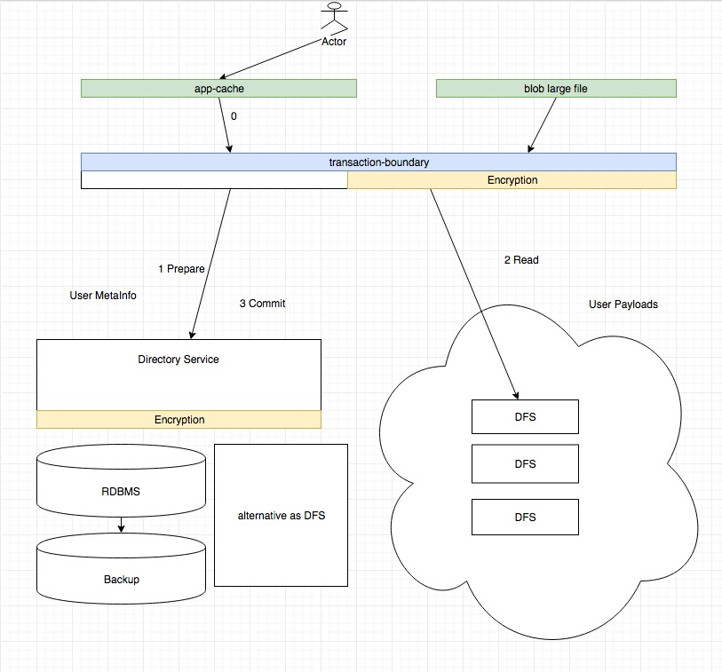

# Datasafe Directory Service

Module designed to provide lookup information to user and guest.  Use this module to:
- Register and manage the user profile
- Read the user public profile
- Read the user private profile
- Obtain credential to access the user dfs public space, and corresponding bucket access credentials
- Obtain credential to access to use dfs private space, and corresponding bucket access credentials

Directory service can either be implemented using a DFS based or an RDBMS based backend.

