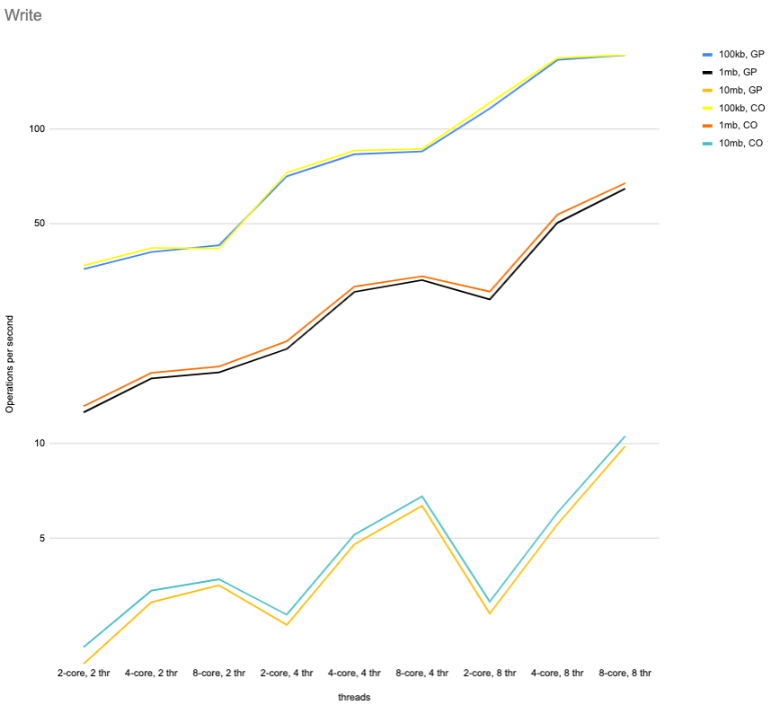
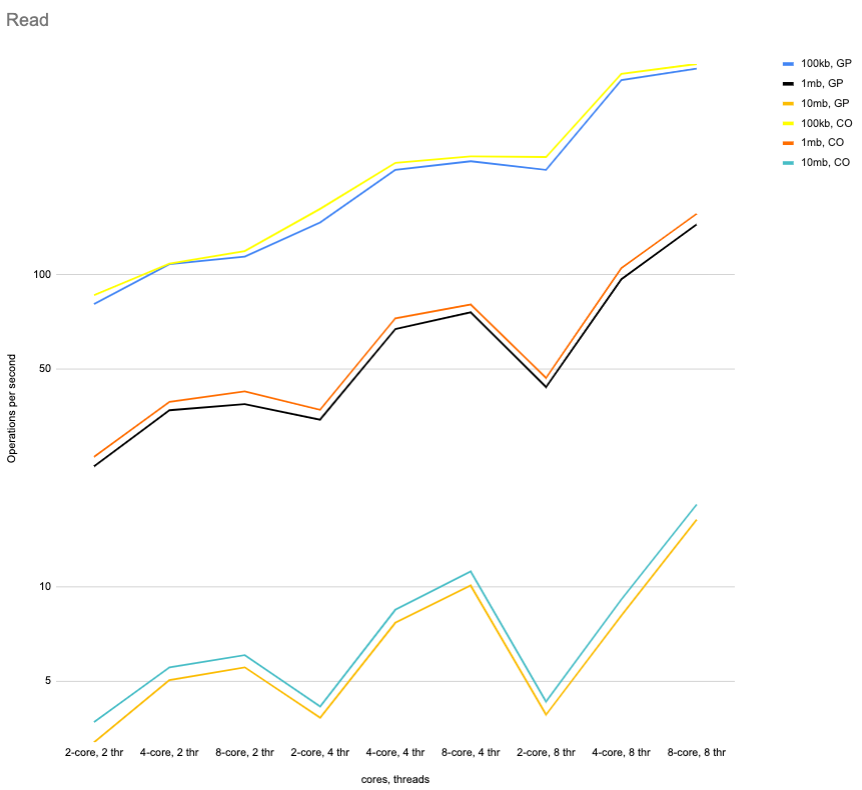
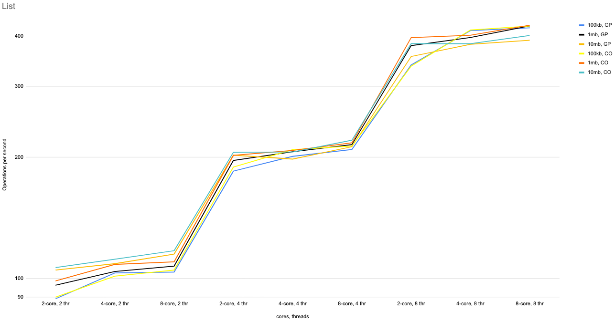
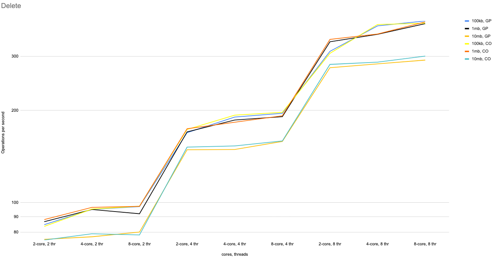
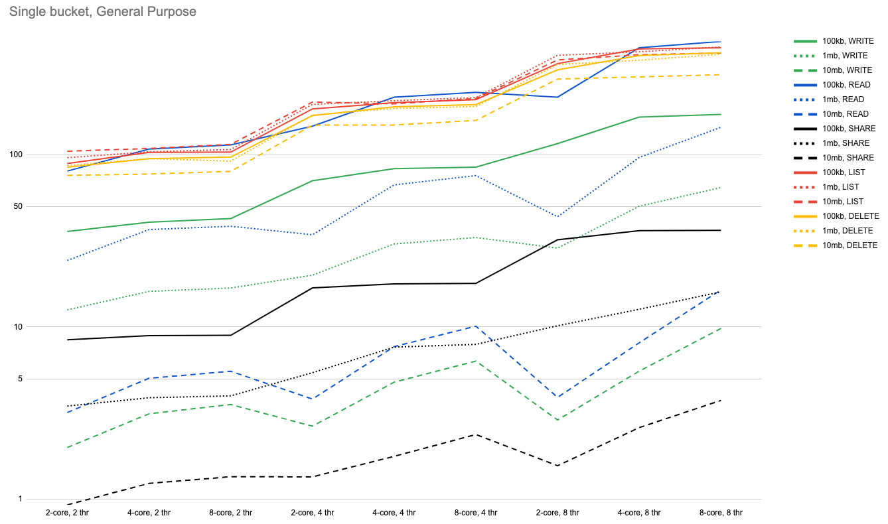
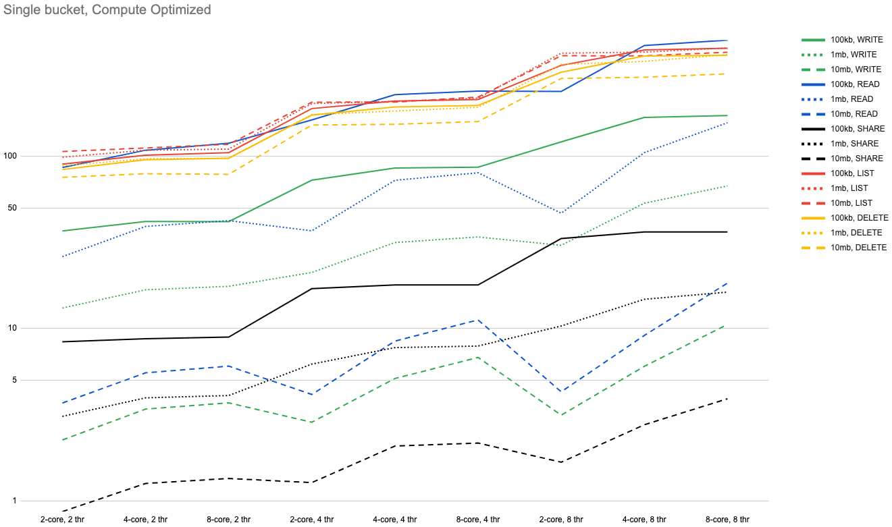
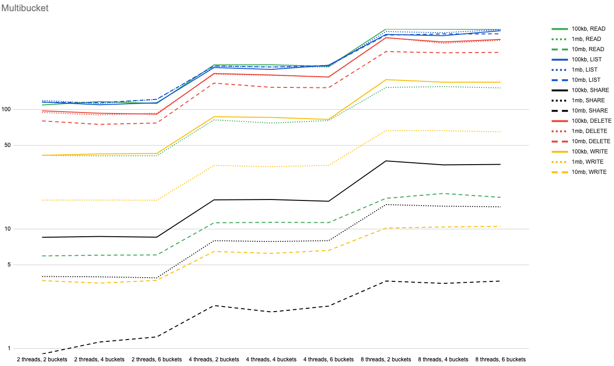
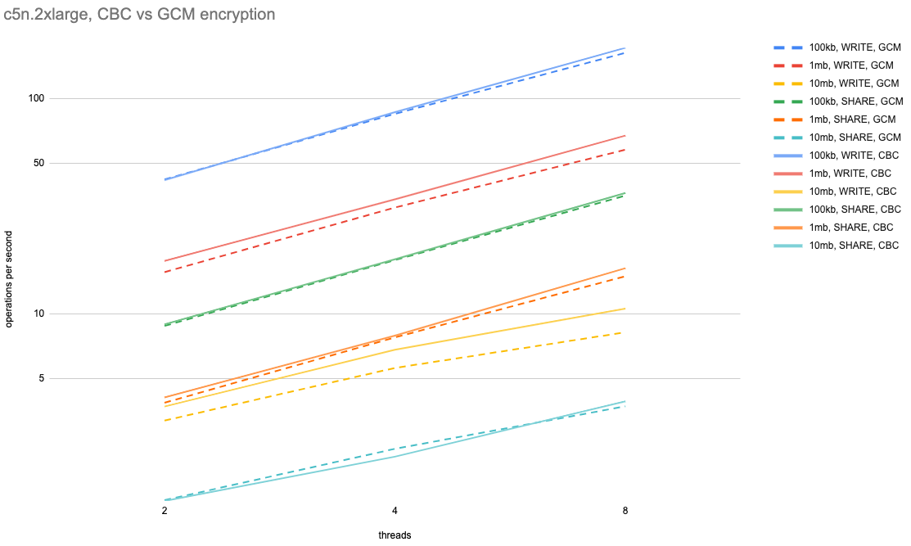
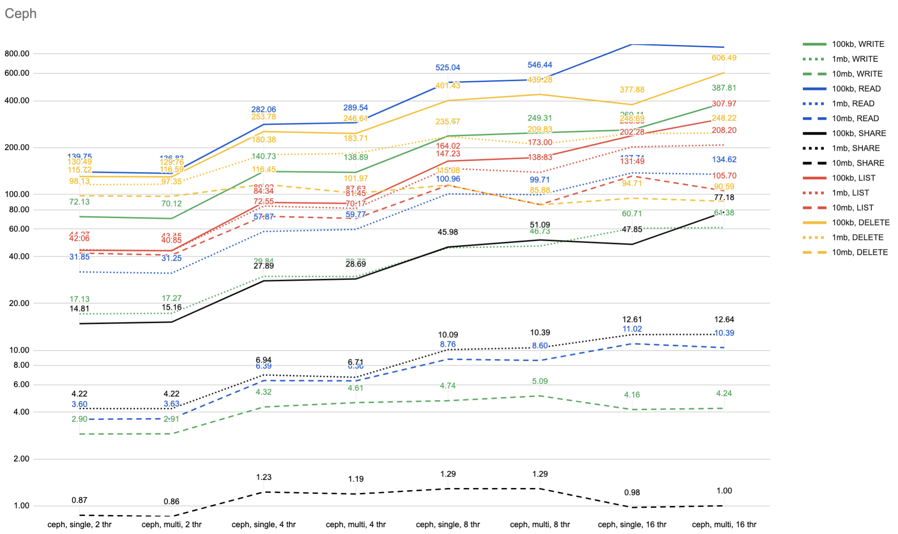

# Datasafe long run test results

### 1. Testing procedure description.

Tests were done on 6 different aws ec2 instances:

-   m5.large (2 CPU, 8GB RAM);
-   m5.xlarge (4 CPU, 16GB RAM);
-   m5.2xlarge (8 CPU, 32GB RAM);
-   c5n.large (2 CPU, 5.25GB RAM);
-   c5n.xlarge (4 CPU, 10.5GB RAM);
-   c5n.2xlarge (8 CPU, 21GB RAM).

On chart, **GP** stands for General Purpose (m5) instances and  **CO** - for Compute Optimized (c5n).

For statistics and repetition, test was executed in following manner:
1. Test suite consisted of same operation sequence that was executed by 2, 4 and 8 threads 
and had 100kb, 1mb, 10mb file size as payload.
1. Test suite was executed 3 times per day on fixed time (Day suite)
1. Day suite was repeated for 3 days, so each test was done 3 times per day for 3 days
1. JVM was launched with `-Xmx256m`

For testing multi-bucket performance 6 aws s3 buckets were created.
Multi-bucket performance was tested only on c5n.2xlarge instance with using 2, 4, 6 buckets.

Single bucket can be found in [RandomActionsOnDatasafeTest](datasafe-business-tests-random-actions/src/test/java/de/adorsys/datasafe/business/impl/e2e/randomactions/RandomActionsOnDatasafeTest.java) class.
Multibucket test is in [RandomActionsOnMultiBucketTest](datasafe-business-tests-random-actions/src/test/java/de/adorsys/datasafe/business/impl/e2e/randomactions/RandomActionsOnMultiBucketTest.java) class

Example of raw test results:
```text
07:57:55.523 [main] INFO de.adorsys.datasafe.business.impl.e2e.randomactions.RandomActionsOnDatasafeTest - ==== Statistics for AMAZON with 2 threads and 100 Kb filesize: ====
07:57:55.532 [main] INFO de.adorsys.datasafe.business.impl.e2e.randomactions.RandomActionsOnDatasafeTest - WRITE : StatisticService.Percentiles(stat={50=35.0, 99=113.73, 90=79.0, 75=57.0, 95=87.65}, throughputPerThread=21.199480270806266)
07:57:55.532 [main] INFO de.adorsys.datasafe.business.impl.e2e.randomactions.RandomActionsOnDatasafeTest - SHARE : StatisticService.Percentiles(stat={50=210.0, 99=537.75, 90=354.5, 75=299.5, 95=440.25}, throughputPerThread=4.598540145985401)
07:57:55.532 [main] INFO de.adorsys.datasafe.business.impl.e2e.randomactions.RandomActionsOnDatasafeTest - LIST : StatisticService.Percentiles(stat={50=18.0, 99=45.39, 90=25.0, 75=21.0, 95=29.95}, throughputPerThread=53.27014218009479)
07:57:55.532 [main] INFO de.adorsys.datasafe.business.impl.e2e.randomactions.RandomActionsOnDatasafeTest - DELETE : StatisticService.Percentiles(stat={50=17.0, 99=47.73, 90=26.0, 75=19.0, 95=35.65}, throughputPerThread=51.12889738382511)
07:57:55.532 [main] INFO de.adorsys.datasafe.business.impl.e2e.randomactions.RandomActionsOnDatasafeTest - CREATE_USER : StatisticService.Percentiles(stat={50=397.0, 99=1020.61, 90=639.1, 75=552.0, 95=851.05}, throughputPerThread=2.0807324178110695)
07:57:55.533 [main] INFO de.adorsys.datasafe.business.impl.e2e.randomactions.RandomActionsOnDatasafeTest - READ : StatisticService.Percentiles(stat={50=16.0, 99=51.09, 90=18.0, 75=17.0, 95=21.0}, throughputPerThread=59.33647388994688)

07:59:13.117 [main] INFO de.adorsys.datasafe.business.impl.e2e.randomactions.RandomActionsOnDatasafeTest - ==== Statistics for AMAZON with 2 threads and 1024 Kb filesize: ====
07:59:13.117 [main] INFO de.adorsys.datasafe.business.impl.e2e.randomactions.RandomActionsOnDatasafeTest - WRITE : StatisticService.Percentiles(stat={50=106.0, 99=168.82, 90=132.0, 75=116.0, 95=146.0}, throughputPerThread=9.077864651966383)
07:59:13.117 [main] INFO de.adorsys.datasafe.business.impl.e2e.randomactions.RandomActionsOnDatasafeTest - SHARE : StatisticService.Percentiles(stat={50=470.5, 99=855.25, 90=747.5, 75=670.25, 95=783.25}, throughputPerThread=2.120855074903215)
07:59:13.117 [main] INFO de.adorsys.datasafe.business.impl.e2e.randomactions.RandomActionsOnDatasafeTest - LIST : StatisticService.Percentiles(stat={50=16.0, 99=53.39, 90=23.0, 75=19.0, 95=25.0}, throughputPerThread=55.22256067603419)
07:59:13.118 [main] INFO de.adorsys.datasafe.business.impl.e2e.randomactions.RandomActionsOnDatasafeTest - DELETE : StatisticService.Percentiles(stat={50=17.0, 99=61.46, 90=30.0, 75=20.0, 95=45.0}, throughputPerThread=49.51411383618695)
07:59:13.118 [main] INFO de.adorsys.datasafe.business.impl.e2e.randomactions.RandomActionsOnDatasafeTest - CREATE_USER : StatisticService.Percentiles(stat={50=359.0, 99=552.8199999999999, 90=470.2, 75=421.75, 95=516.1}, throughputPerThread=2.632271650434325)
07:59:13.118 [main] INFO de.adorsys.datasafe.business.impl.e2e.randomactions.RandomActionsOnDatasafeTest - READ : StatisticService.Percentiles(stat={50=45.0, 99=79.09, 90=50.0, 75=47.0, 95=57.0}, throughputPerThread=21.367984118390183)

08:04:13.146 [main] INFO de.adorsys.datasafe.business.impl.e2e.randomactions.RandomActionsOnDatasafeTest - ==== Statistics for AMAZON with 2 threads and 10240 Kb filesize: ====
08:04:13.147 [main] INFO de.adorsys.datasafe.business.impl.e2e.randomactions.RandomActionsOnDatasafeTest - WRITE : StatisticService.Percentiles(stat={50=511.0, 99=1052.67, 90=617.0, 75=540.75, 95=682.0}, throughputPerThread=1.7302486534758463)
08:04:13.147 [main] INFO de.adorsys.datasafe.business.impl.e2e.randomactions.RandomActionsOnDatasafeTest - SHARE : StatisticService.Percentiles(stat={50=1503.5, 99=2321.5, 90=2135.5, 75=1822.0, 95=2188.5}, throughputPerThread=0.7149220110869652)
08:04:13.147 [main] INFO de.adorsys.datasafe.business.impl.e2e.randomactions.RandomActionsOnDatasafeTest - LIST : StatisticService.Percentiles(stat={50=15.0, 99=51.39, 90=23.0, 75=18.0, 95=30.9}, throughputPerThread=57.84273363524084)
08:04:13.147 [main] INFO de.adorsys.datasafe.business.impl.e2e.randomactions.RandomActionsOnDatasafeTest - DELETE : StatisticService.Percentiles(stat={50=21.0, 99=64.0, 90=36.3, 75=23.0, 95=48.65}, throughputPerThread=39.00483003736444)
08:04:13.147 [main] INFO de.adorsys.datasafe.business.impl.e2e.randomactions.RandomActionsOnDatasafeTest - CREATE_USER : StatisticService.Percentiles(stat={50=414.0, 99=584.28, 90=496.8, 75=469.75, 95=545.4}, throughputPerThread=2.3832221163012393)
08:04:13.147 [main] INFO de.adorsys.datasafe.business.impl.e2e.randomactions.RandomActionsOnDatasafeTest - READ : StatisticService.Percentiles(stat={50=319.0, 99=458.53, 90=362.0, 75=334.0, 95=390.45}, throughputPerThread=3.051153201906971)
```

Then results was parsed and transformed with help of [parse_script.groovy](datasafe-business-tests-random-actions/parse_script.groovy) to suitable for charts builder view.

```text
WRITE
Threads	100kb	1mb	10mb
2	42.39896054161253	18.155729303932766	3.4604973069516927
SHARE
Threads	100kb	1mb	10mb
2	9.197080291970803	4.24171014980643	1.4298440221739304
LIST
Threads	100kb	1mb	10mb
2	106.54028436018957	110.44512135206838	115.68546727048168
DELETE
Threads	100kb	1mb	10mb
2	102.25779476765022	99.0282276723739	78.00966007472888
READ
Threads	100kb	1mb	10mb
2	118.67294777989376	42.735968236780366	6.102306403813942  
```

### 2.  Test result charts.

1.  WRITE operation



2.  READ operation



3.  SHARE operation


4.  LIST operation



5.  DELETE Operation



Single bucket ALL-IN-ONE Chart





MULTIBUCKET TEST



All tests were made using AES256_CBC Encryption algorithm. On next chart test results using AES256_GCM comparing to AES256_CBC.


### 3. CEPH S3 storage test

For Ceph testing, cluster consists of osd1, osd2, osd3 t2.xlarge ec2 instances and t2.large instances for ceph monitor and gateway.

9 volumes with size 100gb and type io2 with 4000 IOPS were used as storage.

Each test was run with 2, 4, 8, 16 threads with single bucket and multi bucket(3 buckets were used) from ec2 c5n.2xlarge(8core) instance. 


