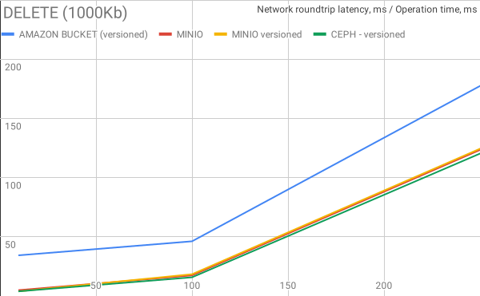
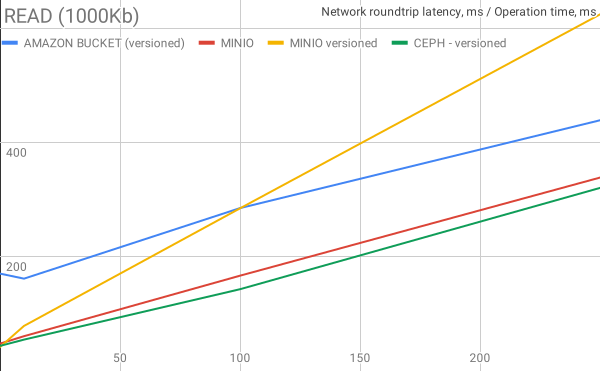
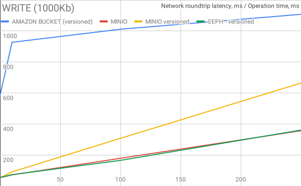

# Versioned storage performance
Test imitated 10 users performing different random actions on storage (report is for privatespace)
	
For details see :
 - de.adorsys.datasafe.business.impl.e2e.AmazonPerformance
 - de.adorsys.datasafe.business.impl.e2e.CephPerformance
 - de.adorsys.datasafe.business.impl.e2e.MinioPerformance

Performance statistic per operation:

## Delete operation on 1000Kb files

## List operation on 1000Kb files

## Read operation on 1000Kb files

## Write operation on 1000Kb files

## Raw data (Duration of operation, 95th percentile, ms):

| OPERATION | Network roundtrip,ms | AMAZON BUCKET (versioned), ms | MINIO, ms | MINIO software versioned, ms | CEPH - versioned, ms | 
|-----------|----------------------|-------------------------------|-----------|------------------------------|----------------------| 
| DELETE    | 0                    | 34.4                          | 5         | 4                            | 4                    | 
| 1000Kb    | 10                   | 46.2                          | 17.4      | 18.4                         | 15.8                 | 
|           | 100                  | 177.4                         | 123.4     | 124.4                        | 120.3                | 
|           | 250                  | 317.4                         | 301       | 304                          | 297                  | 
|           |                      |                               |           |                              |                      | 
|           | LATENCY              | AMAZON BUCKET (versioned)     | MINIO     | MINIO software versioned     | CEPH - versioned     | 
| LIST      | 0                    | 36.7                          | 5.1       | 8                            | 4.8                  | 
| 1000Kb    | 10                   | 65.8                          | 17        | 34                           | 15.5                 | 
|           | 100                  | 150.3                         | 127       | 214                          | 119                  | 
|           | 250                  | 323.6                         | 306.1     | 507.6                        | 305.1                | 
|           |                      |                               |           |                              |                      | 
|           | LATENCY              | AMAZON BUCKET (versioned)     | MINIO     | MINIO software versioned     | CEPH - versioned     | 
| READ      | 0                    | 170.6                         | 48        | 42                           | 44                   | 
| 1000Kb    | 10                   | 161.8                         | 61        | 79                           | 55                   | 
|           | 100                  | 285.4                         | 167       | 285                          | 143.3                | 
|           | 250                  | 439.3                         | 338.9     | 624.8                        | 320.8                | 
|           |                      |                               |           |                              |                      | 
|           | LATENCY              | AMAZON BUCKET (versioned)     | MINIO     | MINIO software versioned     | CEPH - versioned     | 
| WRITE     | 0                    | 583                           | 54        | 53                           | 55                   | 
| 1000Kb    | 10                   | 927.25                        | 71.75     | 91                           | 73.3                 | 
|           | 100                  | 1011.5                        | 178.75    | 307.75                       | 165.3                | 
|           | 250                  | 1107.75                       | 356.75    | 664.25                       | 360.8                | 

