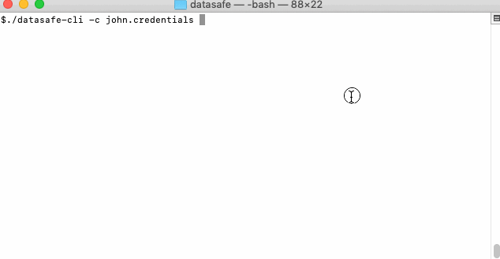

## Quick demo
### Datasafe-CLI
You can try datasafe as a CLI (command-line-interface) executable for encryption of your own sensitive files.
Your encrypted files can be saved either in S3 bucket or local filesystem safely, because encryption will happen
locally - on your machine (See [CLI-README](datasafe-cli/README.md) for details).

**Download CLI executable**:

1. [MacOS native executable](https://github.com/adorsys/datasafe/releases/download/v0.7.0/datasafe-cli-osx-x64)
1. [Linux native executable](https://github.com/adorsys/datasafe/releases/download/v0.7.0/datasafe-cli-linux-x64)
1. Windows executable (N/A yet), please use java version below
1. [Java-based jar](https://github.com/adorsys/datasafe/releases/download/v0.7.0/datasafe-cli.jar), requires JRE (1.8+), use `java -jar datasafe-cli.jar` to execute

#### Example actions:
##### Download application and create new user:

<details><summary>New profile animation transcript</summary>

- Download CLI application (MacOS url)

```bash
curl -L https://github.com/adorsys/datasafe/releases/download/v0.6.0/datasafe-cli-osx-x64 > datasafe-cli && chmod +x datasafe-cli
```
- Create file with your credentials (they also can be passed through command line)

```bash
echo '{"username": "john", "password": "Doe", "systemPassword": "password"}' > john.credentials
```
- Create your new user profile (credentials come from john.credentials). You can enter value or click enter to accept
the default value when prompted.

```bash
./datasafe-cli -c john.credentials profile create
```
</details>


**Note**: Instead of creating file with credentials you can provide credentials directly into terminal (this is less
secure than having credentials file, but is fine for demo purposes):
```bash
./datasafe-cli -u=MeHappyUser -p=MyCoolPassword -sp=greatSystemPassword private cat secret.txt
```
Command above will show private file `secret.txt` content for user `MeHappyUser` who has password `MyCoolPassword` and
system password `greatSystemPassword`

##### Encrypt and decrypt some secret data for our user:

<details><summary>Encrypting/decrypting data animation transcript</summary>

- Create some unencrypted content

```bash
echo "Hello world" > unencrypted.txt
```
- Encrypt and store file from above in privatespace. In privatespace it will have decrypted name `secret.txt`
```bash
./datasafe-cli -c john.credentials private cp unencrypted.txt secret.txt
```
- Show that filename is encrypted in privatespace:

```bash
ls private
```

- Show that file content is encrypted too:

```bash
cat private/encrypted_file_name_from_above
```

- Decrypt file content:

```bash
./datasafe-cli -c john.credentials private cat secret.txt
```
</details>


##### You can always list available actions in context:

<details><summary>List actions animation transcript</summary>

- Show top-level commands

```bash
./datasafe-cli -c john.credentials
```

- Show commands for privatespace

```bash
./datasafe-cli -c john.credentials private
```
</details>



### REST API demo
[Here](../../datasafe-rest-impl/DEMO.md) you can find quick docker-based demo of project capabilities with
instructions of how to use it (REST-api based to show how to deploy as encryption server).
